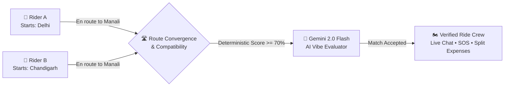
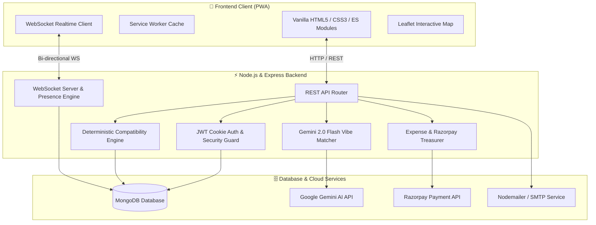

<div align="center">

# 🏍️ RoamAround
### *Intelligent Companion Matching & Real-Time Coordination for Moto Adventures*

<p align="center">
  <a href="https://roamaround-ivory.vercel.app/"></a>
  <a href="https://nodejs.org/"></a>
  <a href="https://www.mongodb.com/"></a>
  <a href="https://ai.google.dev/"></a>
  <a href="https://github.com/websockets/ws"></a>
  <a href="https://web.dev/progressive-web-apps/"></a>
  <a href="LICENSE"></a>
</p>

<p align="center">
  <strong>Find compatible travel partners for motorcycle expeditions, road trips, and backcountry trails.</strong><br>
  Route convergence matching • Deterministic + AI vibe analysis • Real-time crew chat • Expense splitting • Emergency SOS toolkit
</p>

<p align="center">
  <a href="https://roamaround-ivory.vercel.app/"><strong>Explore Live App »</strong></a>
  &nbsp;•&nbsp;
  <a href="#-quick-start"><strong>Quick Start</strong></a>
  &nbsp;•&nbsp;
  <a href="#-core-features"><strong>Features</strong></a>
  &nbsp;•&nbsp;
  <a href="#-system-architecture"><strong>Architecture</strong></a>
  &nbsp;•&nbsp;
  <a href="#-ai-matching-engine--benchmarks"><strong>AI Benchmarks</strong></a>
  &nbsp;•&nbsp;
  <a href="#-api-reference"><strong>API Reference</strong></a>
</p>

</div>

---

## 🌟 Overview

Finding trusted riding companions for long-distance motorcycle touring and road trips is notoriously difficult. Generic social forums lack verification, route alignment, and safety protocols, while standard travel apps only match travelers who share the exact same departure city.

**RoamAround** solves this with an intelligent **dual-layer matching engine** that pairs riders based on **route convergence** (even if starting from different cities), **riding pace**, **daily mileage endurance**, **budget tier**, and **Gemini 2.0 Flash AI vibe scoring**.



---

## 🆚 Why RoamAround?

| Feature | WhatsApp / Telegram Groups | Generic Dating / Social Apps | 🏍️ RoamAround |
| :--- | :---: | :---: | :---: |
| **Route Convergence Matching** | ❌ Manual search | ❌ Location radius only | ✅ **Smart destination & waypoint matching** |
| **Pace & Endurance Filtering** | ❌ None | ❌ None | ✅ **Deterministic scoring (km/day, pace, budget)** |
| **AI Personality Vibe Analysis** | ❌ None | ❌ Basic keyword bio | ✅ **Structured Gemini 2.0 Flash Vibe Evaluator** |
| **Real-time Live Crew Chat** | ⚠️ No built-in verification | ❌ 1-to-1 only | ✅ **WebSocket rooms with presence & live alerts** |
| **Emergency Safety & SOS Toolkit**| ❌ None | ❌ None | ✅ **One-tap SOS broadcast & safety exit rules** |
| **Trip Treasurer & Deposits** | ❌ External spreadsheets | ❌ None | ✅ **Integrated split logger + Razorpay escrow** |
| **Post-Ride Reputation** | ❌ Zero accountability | ❌ Rare | ✅ **Mutual verified rider reviews & badges** |

---

## ✨ Core Features

### 🤖 1. Dual-Engine Matching Pipeline
* **Deterministic Compatibility Engine (0–100 pts):** Computes date overlap, riding pace compatibility (Cruiser vs. High-Pace), budget tier matching, and Jaccard similarity of travel habits.
* **AI Vibe Matcher (Gemini 2.0 Flash):** Evaluates rider bios, communication style, and travel philosophies with schema-enforced structured JSON output (`vibe_score`, `match`, `reasoning`).
* **Resilient Fallback & Audit Trail:** Every AI decision is persisted to MongoDB. If quota or network limits occur, it seamlessly falls back to deterministic scoring without user disruption.

### 🗺️ 2. AI Itinerary Planner & Interactive Leaflet Maps
* Generates detailed, day-by-day intelligent tour itineraries complete with recommended stops, terrain warnings, and scenic viewpoints via Google Gemini 2.0.
* Interactive map integration with route convergence visualization, meetup pins, and interactive waypoint cards.

### 💬 3. Real-Time Chat & Crew Coordination
* Native WebSocket (`ws`) layer delivering sub-millisecond messaging, online presence indicators, and live unread notifications.
* Instant push events for match invitations, acceptances, withdrawals, and group announcements.

### 🛡️ 4. Rider Safety & SOS Emergency Toolkit
* One-tap emergency broadcast system alerting designated emergency contacts with location data.
* Crew check-in reminders and verified community profiles.
* **Crew Exit Safeguard:** Riders can leave a crew at any point with real-time notification to all participants.

### 💰 5. Trip Treasurer & Expense Splitting
* Built-in multi-currency expense ledger for fuel, tolls, meals, and accommodations.
* Razorpay payment gateway integration with HMAC-verified webhooks and mock payment sandbox for locking in crew commitments.

### 📱 6. Modern PWA & Dual-Theme UI
* Full **Progressive Web App (PWA)** support: installable on iOS, Android, macOS, and Windows with offline asset caching.
* Dynamic **Dark & Light Mode** switcher powered by responsive CSS design tokens and zero heavy frontend bundle overhead.

---

## 🏛️ System Architecture



---

## 📂 Project Structure

```text
RoamAround/
├── 📄 server.js               # Express HTTP server, REST endpoints & WebSocket gateway
├── 🧠 scoring.js              # Deterministic algorithmic compatibility engine
├── 🤖 ai_matcher.js           # Google Gemini 2.0 Flash AI vibe ranking & fallback logic
├── 💳 deposits.js             # Razorpay Trip Treasurer & HMAC payment webhooks
├── 🗺️ map.js                  # Leaflet map rendering & interactive route markers
├── 💬 chat.js                 # Chat interface, thread management & matching grid
├── ⚡ realtime.js             # Client WebSocket connection, ping/pong & live badges
├── 🛡️ safety.js               # Emergency SOS broadcast & safety tools
├── 📊 expenses.js             # Group expense logger, splitting algorithm & balances
├── ⭐ ratings.js              # Mutual rider ratings & post-trip review modal
├── 🎨 theme.js / theme-light  # Dark & Light theme controller & tokens
├── 📲 pwa.js / sw.js          # Service Worker & offline manifest configuration
├── 🎨 styles.css              # Global styles, variables & UI components
├── 📊 dashboard.css           # Dashboard layout & widget styles
├── 📁 eval/                   # AI evaluation harness & calibration dataset
│   ├── 🧪 run_eval.js         # Evaluation benchmark runner
│   ├── 📋 pairs.json          # Curated test pair scenarios
│   └── 👥 profiles.json       # Seed evaluation profiles
└── 📦 package.json            # Node.js dependencies & scripts
```

---

## ⚡ Quick Start

### 1. Prerequisites
* **Node.js** v18.0.0 or higher (`node -v`)
* **MongoDB** v6.0+ (Local instance or [MongoDB Atlas](https://www.mongodb.com/atlas))
* **Google Gemini API Key** (*Optional, for AI planner & AI vibe matching*)

### 2. Clone & Install

```bash
# Clone the repository
git clone https://github.com/parthsarthisaxena/RoamAround.git
cd RoamAround

# Install dependencies
npm install
```

### 3. Environment Configuration

Create a `.env` file in the root directory (or copy from [`.env.example`](.env.example)):

```bash
cp .env.example .env
```

Configure the environment variables:

| Variable | Required | Default | Description |
| :--- | :---: | :---: | :--- |
| `PORT` | No | `3000` | Local server port |
| `MONGODB_URI` | **Yes** | `mongodb://127.0.0.1:27017` | MongoDB connection string |
| `JWT_SECRET` | **Yes** | — | Cryptographically random string (min 32 chars) |
| `GEMINI_API_KEY` | No | `""` | Google Gemini API key for AI features |
| `GEMINI_MODEL` | No | `gemini-2.0-flash` | Gemini model variant |
| `RAZORPAY_KEY_ID` | No | `""` | Razorpay Key ID (*uses mock mode if empty*) |
| `RAZORPAY_KEY_SECRET` | No | `""` | Razorpay Key Secret |
| `RAZORPAY_WEBHOOK_SECRET` | No | `""` | Webhook verification secret |
| `EMAIL_SERVICE` | No | `gmail` | Nodemailer service provider |
| `EMAIL_USER` | No | `""` | Email for OTP password resets |
| `EMAIL_PASS` | No | `""` | App password for SMTP auth |

> [!TIP]
> Generate a strong `JWT_SECRET` in one command:
> ```bash
> node -e "console.log(require('crypto').randomBytes(48).toString('hex'))"
> ```

### 4. Start the Application

```bash
# Development mode (with file watcher)
npm run dev

# Production start
npm start
```

Visit [`http://localhost:3000`](http://localhost:3000) in your browser.

---

## 📊 AI Matching Engine & Benchmarks

RoamAround's matching engine pairs deterministic heuristic scoring with LLM reasoning. To ensure physical rider safety on high-risk expeditions, the system prioritizes **zero false positives** over lenient recall.

```bash
# Run the evaluation benchmark
npm run eval
```

### 📈 Calibration Results across Iterations

| Evaluator / Version | Precision | Recall | F1 Score | Safety Violation Rate | Notes |
| :--- | :---: | :---: | :---: | :---: | :--- |
| **Deterministic Baseline** | `0.83` | `1.00` | `0.91` | 17% | High recall; misses subtle pacing / safety mismatches |
| **AI Prompt v1** | `1.00` | `0.60` | `0.75` | 0% | Overly conservative rejection rate |
| **AI Prompt v2** | `0.63` | `1.00` | `0.77` | 37% | Overly lenient on high-speed vs relaxed rider splits |
| **AI Prompt v4 (Current)** | **`1.00`** | **`0.80`** | **`0.89`** | **0.0%** | **Zero false positives on safety-critical constraints** |

> [!IMPORTANT]
> **Safety-First Philosophy:** On a 4,000-meter Himalayan mountain pass or multi-day highway tour, pairing incompatible riders creates physical danger. RoamAround guarantees a **1.00 Precision score** on safety-critical constraints.

---

## 📡 API Reference

### 🔐 Authentication & Session
| Method | Endpoint | Auth | Description |
| :--- | :--- | :---: | :--- |
| `POST` | `/api/auth/signup` | Public | Register new rider, sets secure `httpOnly` JWT cookie |
| `POST` | `/api/auth/login` | Public | Authenticate user & issue session cookie |
| `POST` | `/api/auth/logout` | Session | Invalidate session cookie |
| `GET` | `/api/auth/me` | Session | Get authenticated user profile |
| `GET` | `/api/auth/token` | Session | Obtain short-lived single-use WebSocket ticket |
| `POST` | `/api/auth/forgot-password` | Public | Dispatch password reset OTP via email |
| `POST` | `/api/auth/reset-password` | Public | Verify OTP and update password |

### 👤 Profile & Reviews
| Method | Endpoint | Auth | Description |
| :--- | :--- | :---: | :--- |
| `GET` | `/api/profile` | Session | Retrieve personal rider profile |
| `POST` | `/api/profile` | Session | Update bio, vehicle, pace, and riding preferences |
| `GET` | `/api/users/:id` | Session | View public rider profile (with privacy filters) |
| `GET` | `/api/users/:id/reviews` | Session | Fetch reviews received by a rider |
| `POST` | `/api/users/:id/reviews` | Session | Submit mutual rider review (*verified ride crew only*) |

### 🛣️ Trips & Ride Management
| Method | Endpoint | Auth | Description |
| :--- | :--- | :---: | :--- |
| `POST` | `/api/trips` | Session | Publish or update live trip destination and dates |
| `GET` | `/api/trips/mine` | Session | Retrieve current active trip |
| `GET` | `/api/trips/search` | Session | Search upcoming trips by destination keyword |
| `GET` | `/api/rides` | Session | Retrieve past completed rides history |
| `POST` | `/api/rides/end` | Session | Conclude active trip and archive crew for reviews |

### 🤝 Matching & AI Engine
| Method | Endpoint | Auth | Description |
| :--- | :--- | :---: | :--- |
| `GET` | `/api/matches/suggestions` | Session | Retrieve ranked route candidates |
| `POST` | `/api/matches/ai-rank` | Session | Execute Gemini 2.0 AI vibe ranking on candidates |
| `POST` | `/api/matches/:requesterId` | Session | Accept, decline, or cancel match invitation |
| `GET` | `/api/matches/mutual` | Session | Fetch all active matched crew members |
| `POST` | `/api/itinerary` | Session | Generate AI day-by-day itinerary via Gemini |
| `POST` | `/api/ai/suggest` | Session | AI-assisted bio & preferences writer |

### 💬 Chat, Expenses & Webhooks
| Method | Endpoint | Auth | Description |
| :--- | :--- | :---: | :--- |
| `GET` | `/api/messages/:threadId` | Session | Fetch paginated chat history |
| `POST` | `/api/messages/:threadId` | Session | Post new chat message |
| `GET` | `/api/expenses/:tripId` | Session | Fetch group expense ledger & splits |
| `POST` | `/api/expenses/:tripId` | Session | Record new shared expense |
| `POST` | `/api/mock/pay` | Public | Mock payment verification sandbox |
| `POST` | `/api/razorpay/webhook` | HMAC | Razorpay payment confirmation webhook |

---

## 🔒 Security & Best Practices

* 🛡️ **`httpOnly` & `SameSite=Lax` Cookies:** Prevents token exposure to JavaScript and mitigates cross-site scripting (XSS) exfiltration.
* 🔑 **Short-Lived WebSocket Tickets:** Handshake authenticates via single-use ephemeral tokens generated by `/api/auth/token` rather than leaking JWTs in URL parameters.
* ⚡ **Constant-Time HMAC Validation:** Webhook signatures validated using `crypto.timingSafeEqual` to prevent timing attacks.
* 🧹 **Input Sanitization & Query Isolation:** MongoDB queries strictly structured to prevent injection attacks; rate limits applied across sensitive routes.

---

## 🗺️ Roadmap

- [x] Dual Matching Engine (Deterministic + Gemini 2.0 Flash)
- [x] Real-time WebSockets chat & presence indicators
- [x] Interactive Leaflet route map & convergence visualization
- [x] Emergency SOS broadcast & safety exit rules
- [x] Trip expense splitter & Razorpay deposit integration
- [x] Offline-capable Progressive Web App (PWA)
- [ ] GPX Route Import & Export support
- [ ] Live Turn-by-Turn GPS group tracking on mobile
- [ ] Offline Mesh Bluetooth synchronization for low-connectivity trails

---

## 🤝 Contributing

Contributions are what make the open-source community an incredible place to learn, inspire, and create. Any contributions you make are **greatly appreciated**.

1. Fork the Project
2. Create your Feature Branch (`git checkout -b feature/AmazingFeature`)
3. Commit your Changes (`git commit -m 'feat: Add AmazingFeature'`)
4. Push to the Branch (`git push origin feature/AmazingFeature`)
5. Open a Pull Request

---

## 📄 License

Distributed under the **MIT License**. See [`LICENSE`](LICENSE) for more information.

<div align="center">
  <br>
  <sub>Built with ❤️ for motorcyclists, adventurers, and road-trippers worldwide.</sub><br>
  <sub>Explore the live deployment at <a href="https://roamaround-ivory.vercel.app/"><strong>roamaround-ivory.vercel.app</strong></a></sub>
</div>